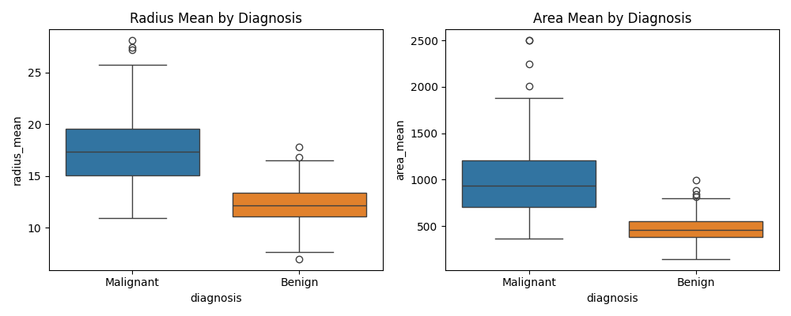
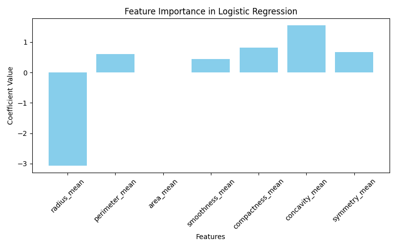
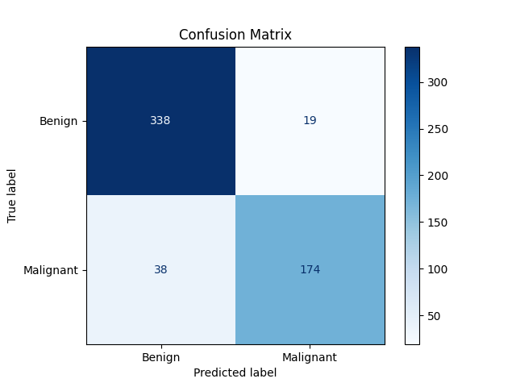
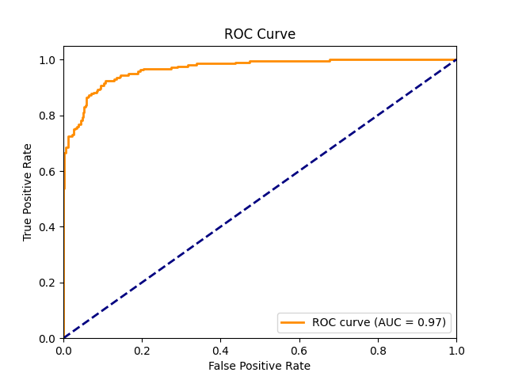

# Classifying Breast Cancer Tumors: Building a classifier using Logistic Regression

Welcome to my first step into machine learning! A few months ago, I started learning ML with Python, and this project is the result: a logistic regression model to classify breast tumors as Benign or Malignant. It’s been an exciting journey of exploring data, building models, and visualizing results. This repo contains the code, visuals, and lessons from that process.

## Project Overview

Using a breast cancer dataset, I trained a logistic regression model to predict tumor diagnosis based on features like radius, perimeter, and area. The model achieved **90% accuracy**, and I added visualizations to understand the data and evaluate performance. This project marks the beginning of my ML adventure—check it out and let me know what you think!

## Project Workflow

### 1. Importing Libraries:
Pandas is used for managing the dataframes/data manipulation & Logistic Regression from sklearn is used to classify the Tumor cells that whether they are Benign or Malignant. You may need to install libraries first if these are not installed. These can be simply installed by going into terminal and **pip install pandas** or **pip install sklearn**

### 2. Data Handling:
Data is loaded into a DataFrame from a csv file ( Dataset Used: [IBM Skills Network Cancer Dataset](https://cf-courses-data.s3.us.cloud-object-storage.appdomain.cloud/IBM-BD0231EN-SkillsNetwork/datasets/cancer.csv) ). Then Data is splitted into **features** (7 numerical features e.g., `radius_mean`, `area_mean`, `smoothness_mean`, etc) & **target** (diagnosis... either `Benign` or `Malignant`). So that it can be later fitted into the model.

### 3. Model Building:
Logistic Regression model from sklearn is used to classify the data (with max_iterations=200, why? cuz it looked cool). Model is then fitted on data using features & target. and Now our model is ready to predict the values.

### 4. Evaluation:
Predictions are made on the test data & score is calculated using score function.
Here's Classification Report (Precision, Recall, F1-Score, Accuracy) showing how well the model handles Benign vs. Malignant cases separately.
-  Accuracy: 90%
-  Classification Report:
   ```bash
               precision    recall  f1-score   support

      Benign       0.90      0.95      0.92       357
   Malignant       0.90      0.82      0.86       212

    accuracy                           0.90       569
   macro avg       0.90      0.88      0.89       569
   weighted avg       0.90      0.90      0.90       569

### 5. Visualizations
1. **Box Plots**: Shows how `radius_mean` and `area_mean` differ between Benign and Malignant tumors.  
   
2. **Feature Importance**: Displays the logistic regression coefficients for each feature, highlighting their impact on predictions.  
   
3. **Confusion Matrix**: Breaks down true positives, true negatives, false positives, and false negatives.  
   
4. **ROC Curve**: Illustrates the model’s ability to distinguish between classes with an AUC of 0.97.  
   
   
## What did I Learn via this Project?
Doing this project was my first real taste of machine learning, and I picked up a ton! I figured out how to load data with Pandas—it was cool seeing the dataset come to life with just a few lines. Splitting it into features and the target (X and y) made me get how ML needs inputs and outputs separated. Training the logistic regression model was awesome—I had to tweak max_iter to make it work, and it felt like magic when it started predicting. Evaluating it was a big eye-opener; I learned accuracy’s not the whole story—stuff like the confusion matrix and ROC curve showed me where it’s strong or weak, and the classification report broke it down even more with precision and recall. Making predictions on new data was the fun part—seeing Benign or Malignant pop out felt so rewarding. Plus, I got into plotting with seaborn and matplotlib, which helped me visualize everything from data patterns to model results.

## Setup
1. **Download "Classification for Tumors.ipynb" File**
2. **Run the file using any suitable IDE e.g. Jupyter, Pycharm, vscode, etc.**
3. **Use Shift+Enter for Execution of a specific Cell**

## Tools & Libraries
- **Python 3.x**
- **pandas**: Data manipulation
- **scikit-learn**: Logistic regression and metrics
- **seaborn & matplotlib**: Data visualization
